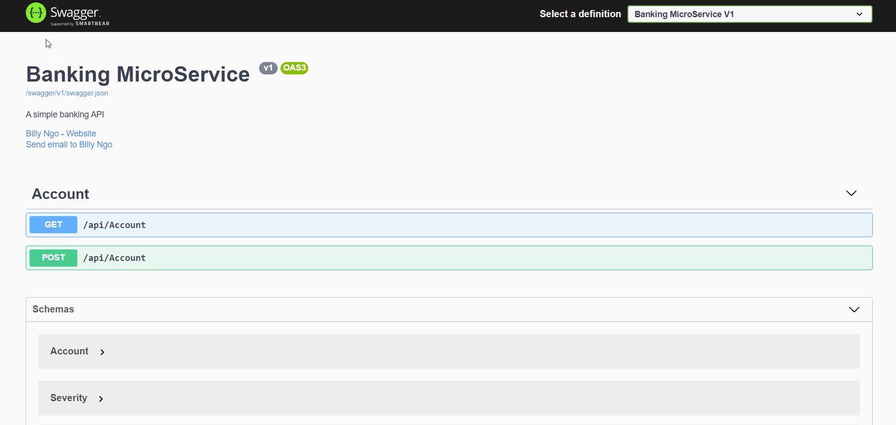
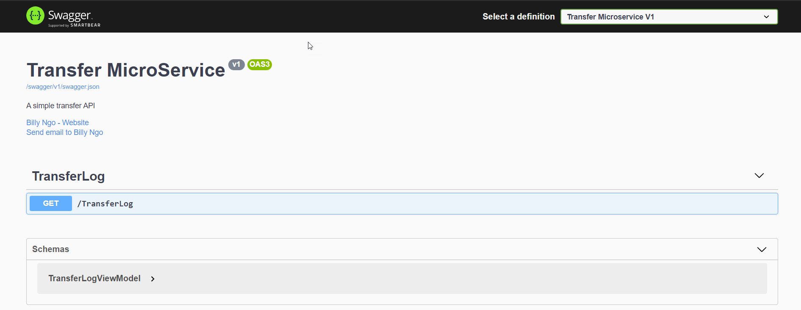

# [.NET Core Microservices with RabbitMQ](https://github.com/BillyNgo/MicroRabbit)

This is a sample for NVG Backend Guild-day: **.NET Core Microservice architecture design pattern with RabbitMQ messaging

.png)

## Projects Treeview

 * [Domain](https://github.com/BillyNgo/MicroRabbit/tree/master/src/Domain)
   * [MicroRabbit.Domain.Core](https://github.com/BillyNgo/MicroRabbit/tree/master/src/Domain/MicroRabbit.Domain.Core)
 * [Infra.Bus](https://github.com/BillyNgo/MicroRabbit/tree/master/MicroRabbit/Infra.Bus)
   * [MicroRabbit.Infra.Bus](https://github.com/BillyNgo/MicroRabbit/tree/master/src/Infra.Bus/MicroRabbit.Infra.Bus)
 * [Infra.Ioc](https://github.com/BillyNgo/MicroRabbit/tree/master/MicroRabbit/Infra.Ioc)
   * [MicroRabbit.Infra.IoC](https://github.com/BillyNgo/MicroRabbit/tree/master/src/MicroRabbit.Infra.IoC)
 * [Microservices](https://github.com/BillyNgo/MicroRabbit/tree/master/src/MicroServices)
   * [Banking](https://github.com/BillyNgo/MicroRabbit/tree/master/src/MicroServices/Banking)
     * [Api](https://github.com/BillyNgo/MicroRabbit/tree/master/src/MicroServices/Banking/Api)
       * [MicroRabbit.Banking.Api](https://github.com/BillyNgo/MicroRabbit/tree/master/srcsrc/MicroServices/Banking/Api/MicroRabbit.Banking.Api)
     * [Application](https://github.com/BillyNgo/MicroRabbit/tree/master/src/MicroServices/Banking/Application)
       * [MicroRabbit.Banking.Application](https://github.com/BillyNgo/MicroRabbit/tree/master/src/Microservices/Banking/Application/MicroRabbit.Banking.Application)
     * [Data](https://github.com/BillyNgo/MicroRabbit/tree/master/src/MicroServices/Banking/Data)
       * [MicroRabbit.Banking.Data](https://github.com/BillyNgo/MicroRabbit/tree/master/src/MicroServices/Banking/Data/MicroRabbit.Banking.Data)
     * [Domain](https://github.com/BillyNgo/MicroRabbit/tree/master/src/MicroServices/Banking/Domain)
       * [MicroRabbit.Banking.Domain](https://github.com/BillyNgo/MicroRabbit/tree/master/src/MicroServices/Banking/Domain/MicroRabbit.Banking.Domain)
   * [Transfer](https://github.com/BillyNgo/MicroRabbit/tree/master/src/MicroServices/Transfer)
     * [Api](https://github.com/BillyNgo/MicroRabbit/tree/master/src/MicroServices/Transfer/Api)
       * [MicroRabbit.Transfer.Api](https://github.com/BillyNgo/MicroRabbit/tree/master/src/MicroServices/Transfer/Api/MicroRabbit.Transfer.Api)
     * [Application](https://github.com/BillyNgo/MicroRabbit/tree/master/src/MicroServices/Transfer/Application)
       * [MicroRabbit.Transfer.Application](https://github.com/BillyNgo/MicroRabbit/tree/master/src/MicroServices/Transfer/Application/MicroRabbit.Transfer.Application)
     * [Data](https://github.com/BillyNgo/MicroRabbit/tree/master/src/MicroServices/Transfer/Data)
       * [MicroRabbit.Transfer.Data](https://github.com/BillyNgo/MicroRabbit/tree/master/src/MicroServices/Transfer/Data/MicroRabbit.Transfer.Data)
     * [Domain](https://github.com/BillyNgo/MicroRabbit/tree/master/src/MicroServices/Transfer/Domain)
       * [MicroRabbit.Transfer.Domain](https://github.com/BillyNgo/MicroRabbit/tree/master/src/MicroServices/Transfer/Domain/MicroRabbit.Transfer.Domain)

## Notable features

- Microservice architecture design pattern
- RabbitMQ messaging

## Project notes

- **MicroRabbit.Banking.Api** project is listening on localhost port `5001` (https) and `5000` (http)

- **MicroRabbit.Transfer.Api** project is listening on localhost port `5003` (https) and `5002` (http)

- **MicroRabbit.MVC** project is listeing on localhost port `5005` (https) and `5004` (http)

### Installation

Check if .NET Core Framework 2.2+ and SQL Server 2016+ is installed on your machine. Next configure the database connection string in `appsettings.json` file before creating a needed database for MicroRabbit.Banking.Api and MicroRabbit.Transfer.Api project. 

To create a database for **MicroRabbit.Banking.Api** project, select `MicroRabbit.Banking.Data` in Visual Studio as >Start Project< and execute the following commands in Package Manager Console:
- `Add-Migration "Initial Migration" -Context BankingDbContext`
- `Update-database`

To create a database for **MicroRabbit.Transfer.Api** project, select `MicroRabbit.Transfer.Data` in Visual Studio as >Start Project< and execute the following commands in Package Manager Console:
- `Add-Migration "Initial Migration" -Context TransferDbContext`
- `Update-database`

After successfully created the BankingDb and the TransferDb databases you can add some test data to Accounts and TransferLogs tables. Alternatively run the MicroRabbit.Banking.Api, MicroRabbit.Transfer.Api and MicroRabbit.MVC and use swagger or MVC form input to create test data. 

## RabbitMQ and erlang notes

If all Api and MVC projects running correctly you can check the queued messages between sender and consumer applications by the microservices architecture design pattern with RabbitMQ.

First download and install [erlang](https://www.erlang.org/downloads) before download and install [RabbitMQ](https://www.rabbitmq.com/download.html) on the same machine the microservcies are running. After erlang and RabbitMQ installations are done, now open RabbitMQ command prompt with administrator rights and type in the following command:
`rabbitmq-plugins enable rabbitmq_management`

Now access the RabbitMQ admin dashboard in a browser on localhost port `1567`. The default username and password for login is `guest`.

Other RabbitMQ commands:
- Stop app `rabbitmqctl stop_app` 
- Start app `rabbitmqctl start_app`
- Reset app  `rabbitmqctl reset`
- Add new user `rabbitmqctl add_user username password`
- Set new role `rabbitmqctl set_user_tags username administrator`
- Set new permission `rabbitmqctl set_permission -p / username ".*" ".*" ".*"`

**RabbitMQ dashboard**

### Pull Requests

When submitting a pull request:

1. Clone the repo.
2. Create a branch off of `master` and give it a meaningful name (e.g. `my-awesome-new-feature`).
3. Open a pull request on GitHub and describe the feature or fix.

---

## Credits

### Creator

**Billy Ngo**

- <https://github.com/billyngo>

### Requirements

- [Visual Studio](https://visualstudio.microsoft.com/de/vs/) or [Visual Studio Code](https://code.visualstudio.com/)
- [.NET Core](https://dotnet.microsoft.com/download)
- [SQL Server](https://www.microsoft.com/de-de/sql-server/sql-server-downloads)

### Packages:

- [Microsoft.NETCore.App](https://dotnet.microsoft.com/)
- [MediatR](https://github.com/jbogard/MediatR)
- [Microsoft.Extensions.DependencyInjection](https://dotnet.microsoft.com/apps/aspnet)
- [Newtonsoft.Json](https://www.newtonsoft.com/json)
- [RabbitMQ.Client](https://www.rabbitmq.com/dotnet.html)
- [Microsoft.AspNetCore.Razor.Design](https://dotnet.microsoft.com/apps/aspnet)
- [Swashbuckle.AspNetCore](https://github.com/domaindrivendev/Swashbuckle.AspNetCore)
- [Microsoft.EntityFrameworkCore](https://docs.microsoft.com/de-de/ef/core/)
- [Microsoft.EntityFrameworkCore.Design](https://docs.microsoft.com/de-de/ef/core/)
- [Microsoft.EntityFrameworkCore.SqlServer](https://docs.microsoft.com/de-de/ef/core/)
- [Microsoft.EntityFrameworkCore.Tools](https://docs.microsoft.com/de-de/ef/core/)

---

## License

MIT License

Copyright (c) 2021 Billy Ngo

Permission is hereby granted, free of charge, to any person obtaining a copy
of this software and associated documentation files (the "Software"), to deal
in the Software without restriction, including without limitation the rights
to use, copy, modify, merge, publish, distribute, sublicense, and/or sell
copies of the Software, and to permit persons to whom the Software is
furnished to do so, subject to the following conditions:

The above copyright notice and this permission notice shall be included in all
copies or substantial portions of the Software.

THE SOFTWARE IS PROVIDED "AS IS", WITHOUT WARRANTY OF ANY KIND, EXPRESS OR
IMPLIED, INCLUDING BUT NOT LIMITED TO THE WARRANTIES OF MERCHANTABILITY,
FITNESS FOR A PARTICULAR PURPOSE AND NONINFRINGEMENT. IN NO EVENT SHALL THE
AUTHORS OR COPYRIGHT HOLDERS BE LIABLE FOR ANY CLAIM, DAMAGES OR OTHER
LIABILITY, WHETHER IN AN ACTION OF CONTRACT, TORT OR OTHERWISE, ARISING FROM,
OUT OF OR IN CONNECTION WITH THE SOFTWARE OR THE USE OR OTHER DEALINGS IN THE
SOFTWARE.

